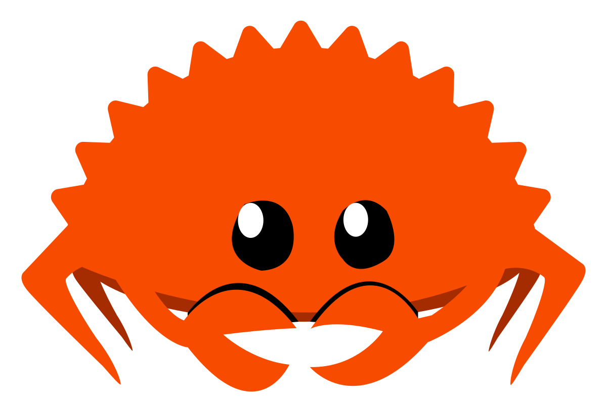

<h1 align="center">Hi 👋, I'm Nazar Burlai, aka NazarHK</h1>
<h3 align="center">Coding Enthusiast | Full-Stack Developer in Progress</h3>

  

  

---

### About Me
- I'm interested in **Full-Stack Development**
- I’m currently learning: **Python, Flask, HTML, CSS, SQLite, a bit of: C, C++, C#, .NET, Rust**
- Exploring new technologies and improving my skills

- **E-Mail:** [nazarburlan2@gmail.com](mailto:nazarburlan2@gmail.com)  
- **Telegram:** @Foxy_anima
- **Discord:** nazarhk

---

### Languages and Tools:

---

### Currently Working On:
- Python applications
- Flask web projects
- Frontend (UI/UX) improvement
- Learning low-level programming with C/C++ and Rust
- Working with SQLite databases
- Exploring Linux environments (Fedora, Debian)

---

### Support Me:

  

